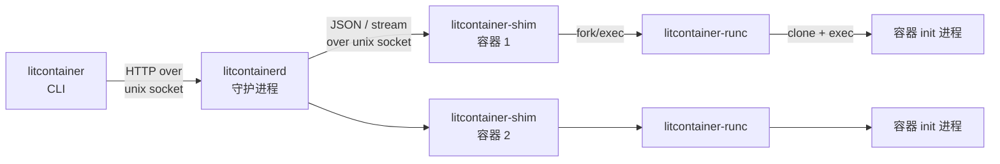

# litcontainer

一个对齐 Docker 架构的容器运行时学习项目，使用 Go 从零实现。

> **项目定位**：本项目以学习和理解 Docker 内部原理为目标，从项目结构、进程模型、通信协议到底层系统调用，尽可能对齐 Docker / containerd / runc 的真实设计，而非追求生产可用。

## 特性

- **四进程架构**：CLI / Daemon / Shim / Runtime 四个独立二进制，对齐 Docker 的进程模型
- **容器生命周期管理**：create / start / stop / kill / rm / ps / inspect / wait，Created → Running → Stopped 状态机
- **Linux 底层隔离**：Namespace（pid/mount/uts/ipc/network）、cgroup v2 资源限制（CPU/内存）、pivot_root 根文件系统切换
- **OverlayFS 分层文件系统**：镜像层（lower）与容器可写层（upper）分离，支持容器导出为镜像
- **流式日志**：`log -f` 持续跟踪容器输出，stdout/stderr 通过 stdcopy 协议（8 字节帧头，与 Docker 二进制兼容）多路复用
- **exec 进入容器**：CGO nsenter（对齐 runc nsexec.c）+ HTTP Hijack 双向流，支持 stdin 透传与退出码回传
- **容器网络**：bridge 驱动、veth 对、预创建 netns、SNAT/端口映射 iptables 规则、基于 BoltDB 的 IPAM
- **Daemon 自愈**：daemon 重启后通过 shim socket 重连存活容器（reconcile），容器不受 daemon 重启影响

## 架构总览



| 二进制 | 对应 Docker 组件 | 职责 |
|---|---|---|
| `litcontainer` | `docker` CLI | 解析命令，通过 unix socket 调用 daemon HTTP API |
| `litcontainerd` | `dockerd` | 常驻守护进程：容器/镜像/网络管理、状态持久化、事件总线、HTTP API |
| `litcontainer-shim` | `containerd-shim` | 每容器一个：作为 init 进程的父进程负责收割、转发 IO、响应 stop/kill/exec |
| `litcontainer-runc` | `runc` | OCI 风格运行时：读 bundle（config.json），创建 namespace/cgroup/rootfs 并启动 init |

> 与真实 Docker 的差异：省略了 containerd 这一层（daemon 直接管理 shim），镜像系统为本地 tar 包（无 layer/manifest/registry）。

## 快速开始

### 环境要求

- Linux（cgroup v2、overlayfs、iptables）
- Go 1.21+，CGO 可用（exec 功能依赖）
- root 权限

### 构建

```bash
go build -o /usr/local/bin/litcontainer ./cmd/litcontainer
go build -o /usr/local/bin/litcontainerd ./cmd/litcontainerd
go build -o /usr/local/bin/litcontainer-shim ./cmd/litcontainer-shim
CGO_ENABLED=1 go build -o /usr/local/bin/litcontainer-runc ./cmd/litcontainer-runc
```

### 准备镜像

将 busybox 根文件系统打成 tar 放到 `/var/local/busybox.tar`：

```bash
docker export $(docker create busybox) -o /var/local/busybox.tar
```

### 运行

```bash
# 启动 daemon
litcontainerd &

# 跑一个容器
litcontainer run --name demo -d busybox sh -c 'while true; do echo hello; sleep 1; done'

# 常用操作
litcontainer ps                       # 列出容器
litcontainer log -f demo              # 流式日志
litcontainer exec demo ps             # 容器内执行命令
litcontainer events                   # 订阅事件流（另开终端）
litcontainer stop demo                # 优雅停止（SIGTERM → 超时 SIGKILL）
litcontainer start demo               # 重新启动已停止的容器
litcontainer rm demo                  # 删除

# 网络与资源
litcontainer network create --driver bridge --subnet 172.20.0.0/16 mynet
litcontainer run --name web -d --net mynet -p 8080:80 -m 100m --cpus 0.5 busybox httpd -f
```

## 命令列表

| 命令 | 说明 |
|---|---|
| `run` | 创建并启动容器（`-d` 后台、`-v` 卷、`-e` 环境变量、`-m`/`--cpus` 资源限制、`--net`/`-p` 网络） |
| `create` / `start` | 分离的创建与启动（对齐 docker create/start 语义） |
| `ps` / `inspect` | 列表 / 详情（运行时状态实时向 shim 查询） |
| `log [-f]` | 查看 / 跟踪日志，stdout/stderr 分流 |
| `exec` | 在运行中容器内执行命令（支持 stdin、退出码透传、`-e`/`-w`） |
| `stop [-t]` / `rm [-f]` | 优雅停止 / 删除 |
| `events` | 订阅容器生命周期事件流 |
| `network create/remove/list/inspect` | 网络管理 |
| `export` | 将容器文件系统导出为镜像 tar |

## 代码结构

```
cmd/
├── litcontainer/         # CLI 入口
├── litcontainerd/        # daemon 入口
├── litcontainer-shim/    # shim 入口（double-fork、subreaper、IO 转发）
└── litcontainer-runc/    # 运行时入口（含 CGO nsenter 构造函数）
internal/
├── cli/                  # CLI 命令实现 + runc 子命令（create/start/init/delete/exec-container）
├── client/               # daemon 的 HTTP 客户端（RPC / 单向流 / hijack 双向流）
├── api/                  # gin 路由、handler、请求响应类型
├── daemon/               # 容器编排核心：生命周期、状态机、spec 生成、reconcile
├── shim/                 # shim server（socket 协议）与 client
├── runtime/              # OCI 风格 Spec / State 定义与读写
├── container/            # 容器配置持久化（state.json）
├── filesys/              # overlayfs、mount、pivot_root、volume
├── cgroups/              # cgroup v2 管理（memory.max / cpu.max）
├── network/              # bridge 驱动、veth、netns、IPAM、iptables
├── stdcopy/              # Docker stdcopy 流协议实现（mux/demux）
├── events/               # daemon 进程内事件总线（fan-out）
└── image/                # 镜像导出
```

## 磁盘布局

```
/var/lib/litcontainer/container/<id>/   # bundle：config.json（OCI spec）、state.json、container.log
/var/lib/litcontainer/overlay/<id>/     # overlayfs：upper/ work/ merged/
/var/lib/litcontainer/image/<image>/    # 解压后的镜像（lower 层）
/run/litcontainer-runc/<id>/            # runc 运行时状态：state.json、exec.fifo、init.pid
/run/litcontainer/shim/<id>/            # shim 运行时：shim.sock、shim.pid、shim.log、runc.log
/run/litcontainer/netns/<id>            # 网络命名空间 bind mount
/sys/fs/cgroup/litcontainer-<id>.scope  # cgroup v2
```

## 已知局限

- 镜像系统为本地 tar，无 layer / manifest / digest / registry 协议
- 不支持 TTY 交互模式（`exec -it` 的 pty 分配）
- 日志无时间戳与轮转（对应 Docker 的 json-file log driver 层未实现）
- 无 restart policy / healthcheck / pause / stats

## License

学习用途，代码可自由参考。
